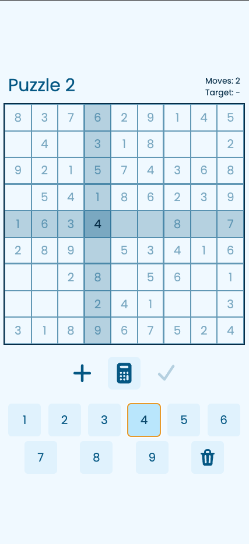
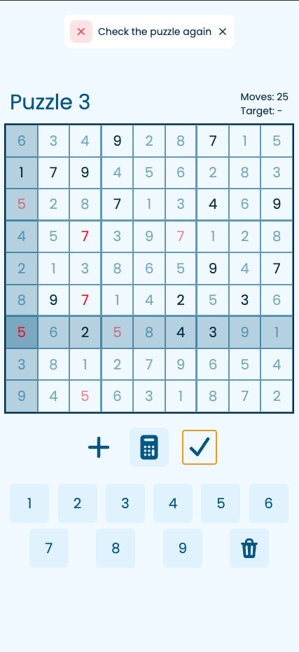
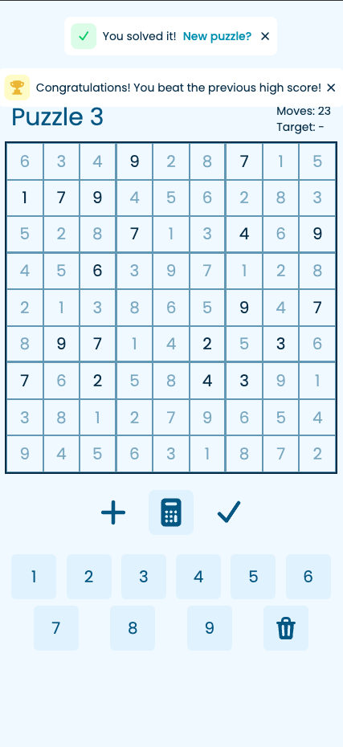

## Sudoku

A Sudoku app built with Next.JS and Supabase, hosted on Vercel at https://sudoku-mob.vercel.app/.

Generate new puzzles to play and solve it with the lowest number of moves.

See how many moves other users took to solve an existing puzzle, beat them to get your score uploaded!

## Running locally

```bash
npm i
npm run dev
```

Preview the app on [http://localhost:3000](http://localhost:3000).

## Screenshots





