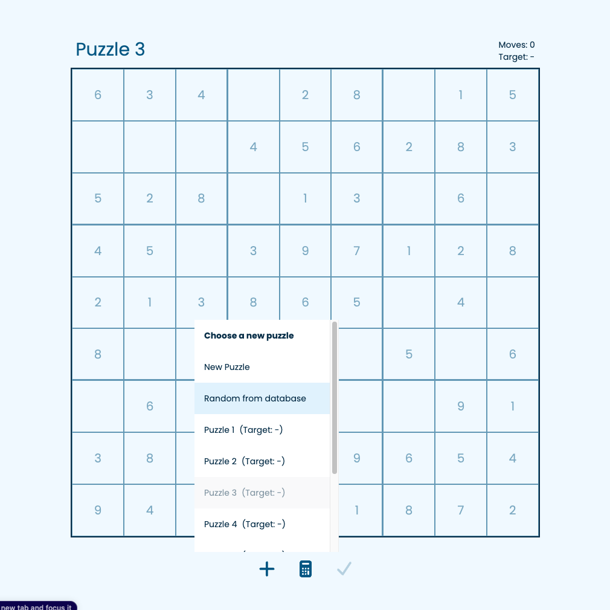

## Sudoku

A Sudoku app built with Next.JS and Supabase, hosted on Vercel at https://sudoku-mob.vercel.app/.

Generate a new puzzle to solve, or select an existing one from the database and see if you can beat the previous score!

## Running locally

```bash
npm i
npm run dev
```

Preview the app on [http://localhost:3000](http://localhost:3000).

## Screenshots





